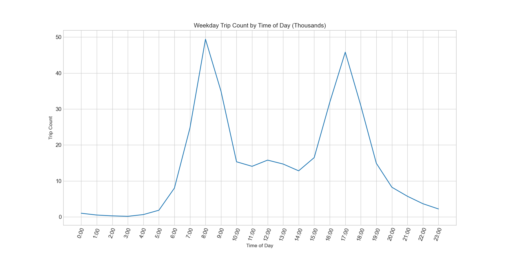
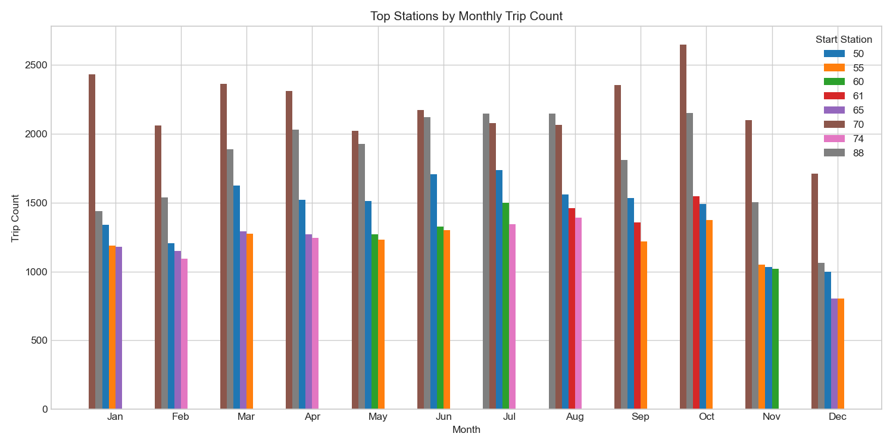
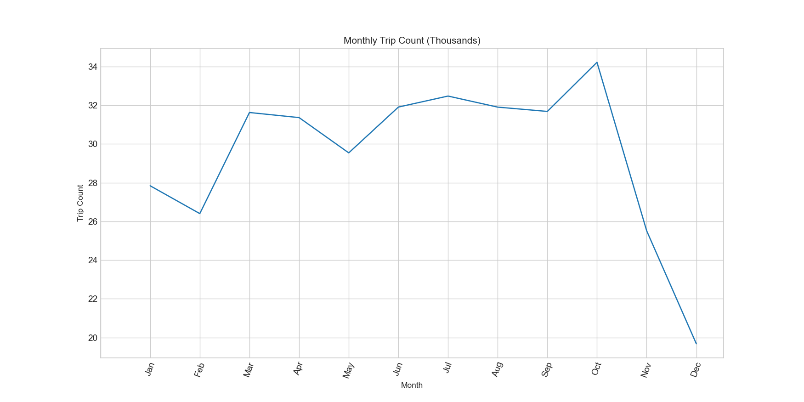

# BikeShare EDA Project

## Objective: 
As part of a coding challenge I recently completed, I received the following assignment, which appears to be a variation on [an existing Kaggle challenge](https://www.kaggle.com/c/bike-sharing-demand). The project description reads as follows (**emphasis** added):
    
>>Beachboys BikeShare is a bike share service provider where users can take and return bikes from any of 70 stations on their network. The company wants to leverage their data to better understand and, hopefully, optimize their operations. They are interested in exploring the potential for machine learning **to predict the number of bikes taken and returned to each station.**

>>The eventual goal is to construct a model that can **predict the net rate of bike renting for a given station (net rate defined as trips ended minus trips started at the station for a given hour).** However, we would like you to just focus on doing the preliminary steps of this work. For this task we would like you to **focus on first doing the exploratory data analysis of the data provided.** Then we would like you to do the necessary data manipulations to create what would be your modeling data set. Finally, we would like you to do a short writeup about your next steps, and what modeling approaches you would examine first. Again, as you go through the work, bear in mind that your goal would be to **forecast net demand by hour by station** but you are not expected to build any models within the time limit.

Accordingly, for this phase of the project I will carry out the relevant EDA to identify the path for predicting net demand by hour by station.
    
## Data

The data contains three CSV files with information on the stations, trips-taken and weather affecting the bikeshare system.

- the stations data includes six columns of information to identify the station, station location and station capacity
- the trips data includes six columns to uniquely identify each of 350k trips, the start time and location of each trip and the type of user
- finally, weather data captures roughly a year of meteorological records from five stations spread throughout the city in 24 columns that include metrics like temperature, dew point, humidity, wind speed, cloud coverage, etc.

While I expect weather to significantly impact demand, I approached the problem as fundamentally a question of station location, usage by time of day and season for the relative stability of these features and because we can always layer the impact of weather on demand later once we understand how the flow of traffic from station to station, hour to hour and day to day affect demand.
Accordingly, I emphasized the features that helped trace the circulation of bike traffic between stations by hour, day, week and month in order to identify weather-independent usage patterns. Station identity and location were established with the unique station ID, name and coordinates from the stations table, whereas the datetime data and station ID from the trips table provided insight into the temporality of bike trips around the city.
    
    
## Exploratory Analysis

To begin, it helps to visualize the location of the stations in the BeachBoys BikeShare system. They cluster first in the northwest within the City of San Francisco and then moving southeast stretch out with less density from Redwood City through Palo Alto and Mountain View before forming a secondary cluster in San Jose.

<!-- /Users/Diogenes/Documents/take_homes/BikeShare/images/bike_station_map.html code goes here -->
<!--<iframe id="inlineFrameExample"
    title="Inline Frame Example"
    width="300"
    height="200"
    src="https://www.openstreetmap.org/export/embed.html?bbox=-0.004017949104309083%2C51.47612752641776%2C0.00030577182769775396%2C51.478569861898606&layer=mapnik">
</iframe>
<iframe id="inlineFrameExample"
    title="Inline Frame Example"
    width="300"
    height="200"
    src="file:///Users/Diogenes/Documents/take_homes/BikeShare/images/bike_station_map.html">
</iframe> -->
<html>
<body>
    <table>
      <tr>
        <td>
        <embed src ="https://www.openstreetmap.org/export/embed.html?bbox=-0.004017949104309083%2C51.47612752641776%2C0.00030577182769775396%2C51.478569861898606&layer=mapnik"
        title="hello"
        width="300"
        height="200"/>
        </td>
        <td>
        <embed src="https://github.com/jkurdys/BikeShare/blob/master/images/bike_station_map.html"
        title="hello"
         width="300"
         height="200"/>
        </td>
      </tr>
       
</table>
</body>
</html>

You can explore this map [as its own web page here](images/bike_station_map.html)

Given the relative density of the stations, I expected to see most usage in San Francisco and San Jose to a lesser extent. The following heatmap demonstrates San Francisco as the most active cluster, followed by San Jose and Mountain View, respectively.

<!-- /Users/Diogenes/Documents/take_homes/BikeShare/images/bike_station_heatmap.html code goes here -->

Besides high level geographic considerations like these, I also expected to see the most popular stations during the week to differ from the most popular weekend stations on the assumption that commuters would make up the bulk of weekday trips while tourism would fuel weekend use.

Trip counts segmented by weekday and weekend useage demonstrates that the top stations in each group are completely distinct with none of the top five weekday stations appearing among the top five weekend stations. It's also important to note that the most popular weekday stations are eight times more popular than the most popular weekend stations suggesting that there is considerable dropoff in use on weekends.

Plotting the daily trip counts confirms the suspicion of weekend dropoff and further demonstrates that weekday usage is fairly stable remaining above 60k daily trips before tapering off slightly on Friday as the weekend approaches. This observation supports the overwhelming conclusion that **the majority of bikeshare useage is functional in the service of daily life rather than appealing to purely recreational interests**.

>**the majority of bikeshare useage is functional in the service of daily life rather than appealing to purely recreational interests**

By far the most significant activity of daily life that bikeshare providers service involves workweek commuter transportation between 8:00 a.m. and 5:00 p.m. that involves a bimodal distribution of traffic that climbs steadily from 6:00 a.m. to 8:00 a.m., falls until 10:00 a.m before reaching a saddle during the lunchtime hours and resuming its climb around 3:00 p.m., reaching a second, symmetrical peak around 5:00 p.m. and declining rapidly throughout "rush hour" until 7:00 p.m.

The following heatmap animates the changing pattern of station traffic according to the previous plot of hourly weekday usage.

<!-- /Users/Diogenes/Documents/take_homes/BikeShare/images/bike_station_heatmap_wTime.html code goes here  -->

While these visualizations illustrate aggregate activity throughout the day on weekdays, it may be of interest to determine whether hourly weekend use follows a different schedule. Sadly, given the relative disparity between weekday and weekend usage, I have not followed that lead here. It seems worth speculating that events such as professional sporting events, concerts and seasonal community events could drive a different pattern of weekend use and so would merit inclusion along with weather as irregular influences on station traffic.

Examining the most popular stations grouped by day of week confirms a shift in usage patterns for more recreational pursuits toward the weekend. Indeed, only one station that appears among the most popular weekday stations on any day also appears among the most popular weekend stations. We see a shift on Friday as stations 55 and 65, the Transbay Terminal at Howard and Beale and the Townsend at 7th stations, respectively, fall out of the top five only to be replaced by stations 61 and 74 (2nd at Townsend and Steuart at Market) of which only the 2nd at Townsend remains popular throughout the weekend.

Speculation that recreation fuels distinct traffic patterns of its own receives further support when we zoom out to examine traffic at the annual level. On the annual scale we see that the more periphery waterfront stations like 60 (Embarcadero at Sansome) and, again, 61 (2nd at Townsend) experience more demand in the warm weather months from May to September. This slight shift from more centrally located stations during the week and cold weather months to waterfront adjacent stations on Friday, throughout the weekend and during warm weather months suggests that recreational use and weather does play a part in traffic patterns and would justify a deeper dive into the distictive patterns of weekend traffic and factoring weather conditions into a predictive model of demand.

Of course, not all seasonal variation can be accounted for in terms of weather, patterns of recreation or even the calendar of public events. In particular, the outsized presence of station 61 (2nd at Townsend) in August, September and October doesn't fit nicely into the theory of warm weather months feeding traffic to waterfront stations since it not only moves into the cooler weather months of autumn, but also coincides with an unexplained peak in October and sudden, rapid decline in bikeshare demand in November and December despite respectable demand in January the previous year. Some events are singular or, at any rate, difficult to predict and the unexpected peak in demand during the period the data was collected, September 2014 to September 2015, likely had more to do with the San Francisco Giants' World Series appearance and victory than with regular seasonal bikeshare demand patterns.

## Considerations and Recommendations

This exploratory data analysis supports predictive modeling that relies heavily features relevant to station location, time of day, day of week and, to a lesser extent, monthly and seasonal event calendars. Since location, daily timetables and both weekly and monthly calendars shape the bulk of demand, these features will provide the most impact for optimizing station inventory efficiency and provide a basis for forecasting without requiring significant model retraining and validation.

Weather conditions also warrant significant consideration although this analysis has not evaluated which weather conditions merit consideration. While weather conditions can be modeled well in advance, the utility of this approach likely approximates the value of seasonal and monthly usage patterns, so the full impact of this approach cannot be carried out with long-term lead times and will require significant retraining, thus exposing the model to increased variability and requiring continuous data collection.

Further analysis using profit curves to identify the optimal balance of long-term planning and short-term optimization of resources should be conducted provide insight into this decision.
